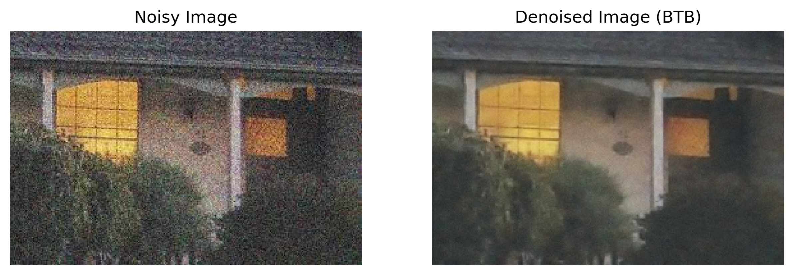
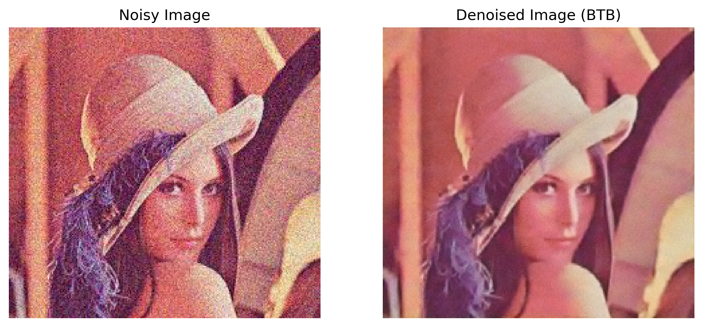
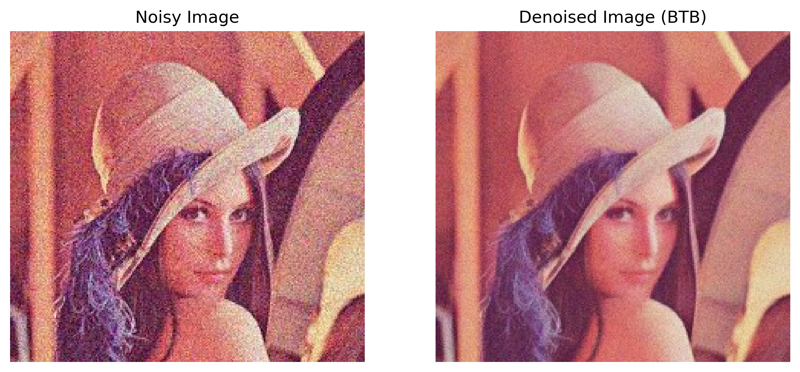

# Back To Basics implementation with Feed Forward Neural Network and BM3D 

# Back to Basics: Denoising Algorithm

## Overview
This repository implements a simple yet effective denoising algorithm inspired by the paper "Back to Basics" (https://arxiv.org/abs/2311.06634). The goal is to remove noise from an input signal or image while preserving its essential features. The algorithm leverages fundamental signal processing techniques, such as filtering and thresholding, to achieve robust denoising performance.
The Back to Basics (BtB) algorithm is a straightforward yet effective denoising technique designed to preserve the essential structures within images while reducing noise.

## Algorithm Description

BtB operates based on local averaging and thresholding principles, emphasizing simplicity and interpretability. The core idea is to replace noisy pixel values with a weighted average of their neighbors while suppressing noise components.
The functions chosen for this implementation were BM3D and one generated by training a Neural Network.

## Mathematical Formulation

### 1. Local Neighborhood Averaging
For each pixel $p_{i,j}$ in the image$I$, define a neighborhood $N_{i,j}$ (e.g., a 3x3 window) centered at $p_{i,j} $.

### 2. Weighted Averaging
Compute the weighted average $\hat{p}_{i,j}$ as:

\in&space;N_{i,j}}w_{k,l}\cdot&space;p_{k,l}}{\sum_{(k,l)\in&space;N_{i,j}}w_{k,l}})

where $w_{k,l}$ are weights assigned based on proximity and similarity to $p_{i,j}$.

### 3. Thresholding
Apply a threshold $T$ to suppress minor variations due to noise:

### 4. Iterative Refinement
Repeat steps 1-3 for a predefined number of iterations or until convergence.

---

## Crucial Code Components

### 1. Neighborhood Extraction
Efficiently extract local neighborhoods using sliding windows.

### 2. Weight Calculation
Compute weights$w_{k,l}$based on Gaussian kernels or similarity measures.

### 3. Thresholding Mechanism
Implement adaptive thresholding to dynamically adjust$T$based on local noise statistics.

### 4. Optimization
Utilize vectorized operations and parallel processing to speed up computations.

# Results

### Results using a Feed Forward Neural Network as function in BTB

### Results using BM3D as function in BTB

